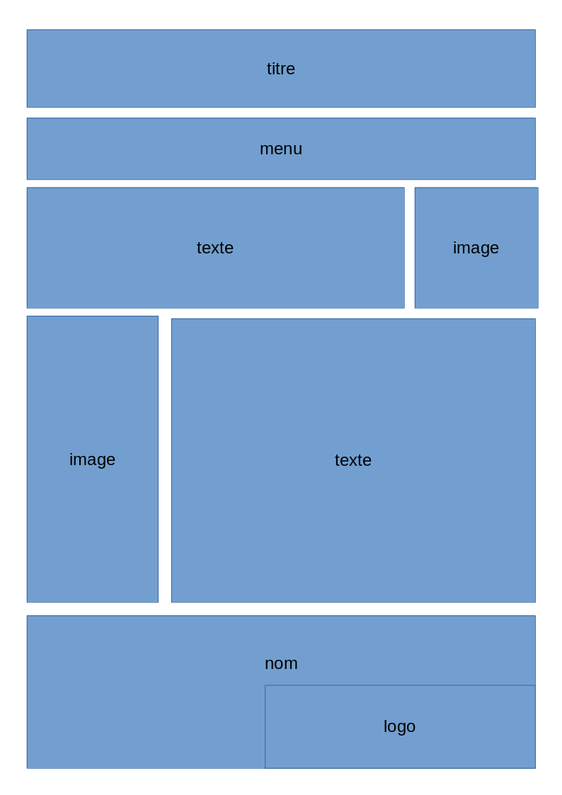
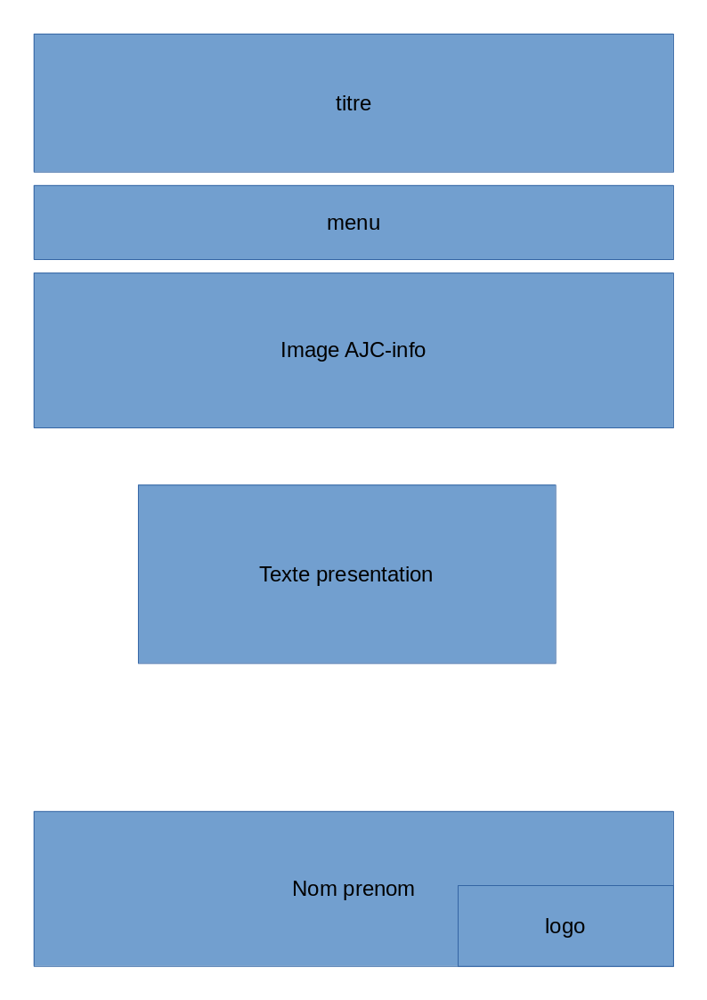
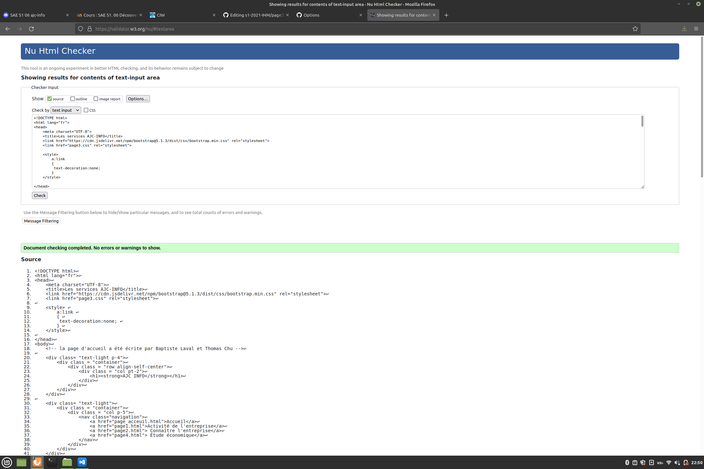

# AJC-INFO: projet Belfort

SAÉ S106: découverte de l’environnementéconomique et écologique

Groupe S1B1

Référent: Laval Baptiste

Chu Thomas
Feddaoui Farès
Hernandez Lilian

https://blaval-iut90.github.io/s1-2021-IHM/

[baptiste laval](mailto:blaval@edu.univ-fcomte.fr?subject=SAE_1_06)

Écran de zoning:

Écrans de prototype:

Page d'acceuil:

Page témoin (squelette général du site)

La page web 3 "Services de l'entreprise" écrite par Thomas Chu a été validé:

